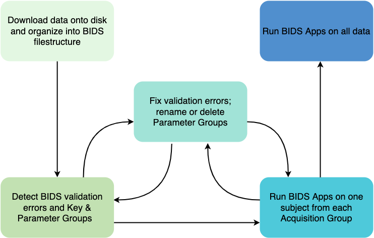

===================
Background 
===================

Motivation
-------------

The Brain Imaging Data Structure (BIDS) is a simple and intuitive way to
organize and describe MRI data [#f1]_. Because of its ease of use, a wide array of
preprocessing and analysis tools and pipelines have been developed specifically
to operate on data curated in BIDS [#f2]_. These tools are able to automatically
self-configure to the user's BIDS dataset, which saves time and effort on the
part of the user. However, as datasets increase in size and complexity, it
can be dangerous to blindly run these pipelines without a careful understanding of
what's really in your BIDS data. Having knowledge of this potential **heterogeneity**
ahead of time gives researchers the ability to **predict pipeline configurations**,
**predict potential errors**, avoid running **unwanted or unusable data**, and **budget
their computational time and resources** effectively.

``CuBIDS`` is designed to facilitate the curation of large, neuroimaging data so
that users can infer useful information from descriptive and accurate BIDS labels
before running pipelines *en masse*. ``CuBIDS`` accomplishes this by summarizing 
BIDS data using :ref:`keygroup` and :ref:`paramgroup` categorizations in your data (we'll explain what these
are in more detail in the next section).

The image below demonstrates the ``CuBIDS`` workflow that we'll discuss on the next page.

``CuBIDS`` also incorporates ``DataLad`` as an optional dependency for maintaining data provenance, enhancing
reproducibility, and supporting collaboration [#f3]_.

Definitions
------------

.. topic:: Key Group

    * A unique set of `BIDS key-value pairs <https://bids-specification.readthedocs.io/en/stable/02-common-principles.html#file-name-structure>`_ , excluding the subject and session keys.
    * Derived from the Filename
    * Example structure: ``acquisition-*_datatype-*_run-*_task-*_suffix`` 

.. topic:: Parameter (Param) Group

    * The set of scans with identical critical imaging parameters. 
    * Defined within a Key Group
    * Numerically identified (e.g. 1, 2, etc.)

.. topic:: Dominant Group

    * The Param Group that contains the highest number of scans in its Key Group.

.. topic:: Variant Group
    
    * Any Param Group that is non-dominant.

.. topic:: Rename Key Group

    * Recommended new Key Group name for variant Param Group 

Examples
""""""""

A dominant resting state BOLD group:
        * Example Filename: ``sub-01_ses-A_task-rest_acq-singleband_bold.nii.gz``
        * Key Group: ``acquisition-singleband_datatype-func_suffix-bold_task-rest``
        * Param Group: ``1`` (Dominaint Group)

A variant resting state BOLD group
        * Example Filename: ``sub-02_ses-A_task-rest_acq-singleband_bold.nii.gz``
        * Key Group: ``acquisition-singleband_datatype-func_suffix-bold_task-rest``
        * Param Group: ``2`` (Variant Group)
        * Rename Key Group: ``acquisition-singlebandVARIANTNoFmap_datatype-func_suffix-bold_task-rest``

In the next section, we'll discuss these definitions in more detail and demonstrate ``CuBIDS`` usage.

.. rubric:: Footnotes

.. [#f1] See the `BIDS Specification <https://bids-specification.readthedocs.io>`_.
.. [#f2] See this list of amazing `BIDS apps <https://bids-apps.neuroimaging.io/>`_.
.. [#f3] See `DataLad <https://www.datalad.org/>`_.