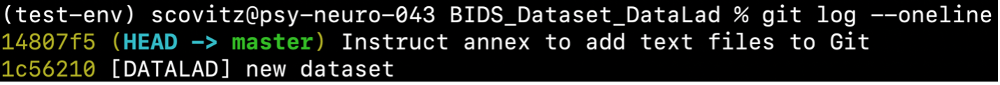
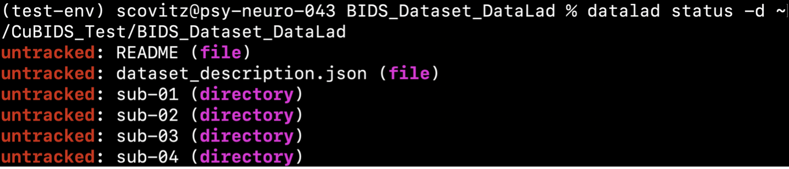
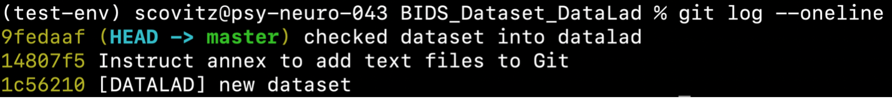
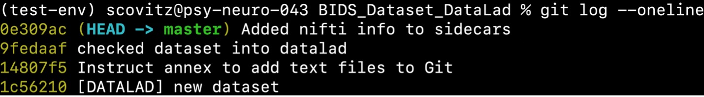
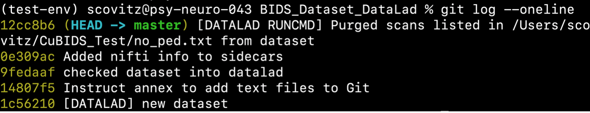
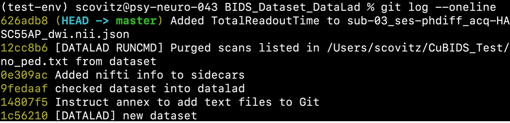
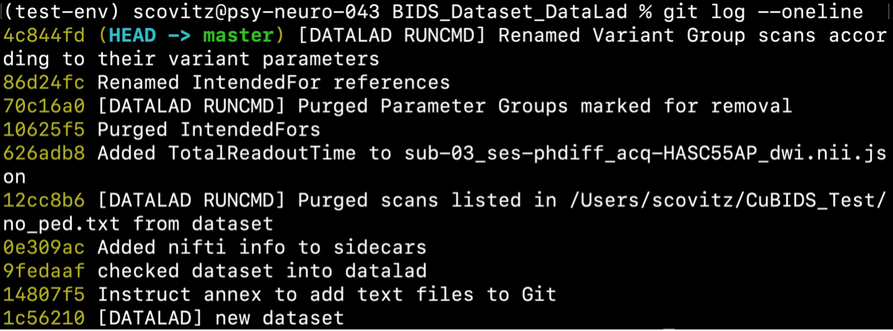
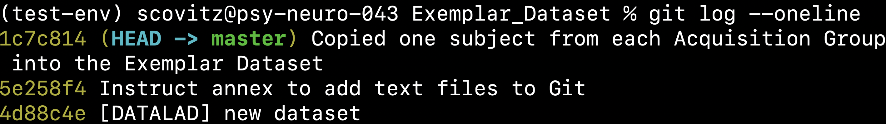

===================
Example Walkthrough
===================

The ``CuBIDS`` workflow is currently being used in neuroimaging labs at a number of institutions 
including University of Pennsylvania, Children's Hospital of Philadelphia, the Child Mind Institute, 
and University of Minnesota's Masonic Institute for the Developing Brain. To demonstrate the utility of
``CuBIDS``, here we apply the software to a small example dataset that is included `in our Github repo <https://github.com/PennLINC/CuBIDS/tree/main/cubids/testdata/BIDS_Dataset>`_.
This example dataset does not contain any PHI. 

Following the installation instructions at :doc:`the installation page <installation>`,
you should have successfully installed ``CuBIDS``, ``DataLad``, and the ``bids-validator`` inside a
conda environment titled "cubids". In this example, we use validator version ``1.7.2``.
Using a different version of the validator may result in slightly different validation
CSV outputs, but the example should still be useful. 

Throughout this example, we use ``DataLad`` for version control. Although ``DataLad``
is an optional dependency of ``CuBIDS``, we use it here to demonstrate its
powerful integration with ``CuBIDS`` and the benefits it can provide its users. 

Now that we have installed CuBIDS and all necessary dependencies, we are ready to begin the curation 
process on our example dataset. We create a ``CuBIDS_Test`` directory to function as our working directory 
and navigate to it as follows:

mkdir $PWD/CuBIDS_Test 
cd CuBIDS_Test

.. code-block:: console

    $ conda activate cubids
    $ mkdir -p $PWD/CuBIDS_Test
    $ cd CuBIDS_Test

Now, download and unzip the example data (you can also do this in your Finder window):

.. code-block:: console
    
    $ curl -sSLO https://github.com/PennLINC/CuBIDS/raw/main/cubids/testdata/BIDS_Dataset.zip
    $ unzip BIDS_Dataset.zip
    $ rm BIDS_Dataset.zip

Identifying and removing PHI 
------------------------------------------

As a first step, we use CuBIDS to identify the metadata fields present in the dataset,
and remove any protected health information (PHI) or other sensitive fields. We want to do this *before* implementing any
``DataLad`` commands, as we must ensure PHI is not tracked as part of version control.

This is accomplished with the following command:

.. code-block:: console

    $ cubids-print-metadata-fields BIDS_Dataset

This command returns a total of 66 fields, including acquisition parameters and other metadata 
fields present in the dataset's JSON sidecars. From the output we can see that the dataset contains
(simulated) PHI — the `PatientName` field, which we wish to remove. 
To remove the `PatientName` field from the sidecars, we can use the command:

.. code-block:: console

    $ cubids-remove-metadata-fields BIDS_Dataset --fields PatientName

This command should succeed silently.

Checking the BIDS dataset into DataLad
-------------------------------------------

Now that all PHI has been removed from the metadata, we are ready to check our dataset into ``datalad``. 
To do this, we run the following command:

.. code-block:: console

    $ datalad create -c text2git BIDS_Dataset_DataLad

This command creates a new directory called ``BIDS_Dataset_DataLad`` where
``DataLad`` will begin implementing version control and provenance tracking while
we implement the rest of our ``CuBIDS`` workflow.
The creation of our ``datalad`` dataset is accordingly reflected in the dataset's version control 
history, accessible with ``git log``. At any point in the ``CuBIDS`` workflow,
we can view a summary of our dataset's version history by running the following commands:

.. code-block:: console 

    $ cd BIDS_Dataset_DataLad
    $ git log --oneline
    $ cd ..

This command will write the following to the terminal: 

Next, we copy the contents of our BIDS dataset into the newly created and currently empty DataLad 
dataset and save the changes. 

.. code-block:: console

    $ cd ..
    $ cp -r BIDS_Dataset/* BIDS_Dataset_DataLad

In addition to being able to access the version history of our data, any point in this workflow, we can 
also check the status of untracked (not yet saved) changes using the datalad status command, as seen 
below: 

.. code-block:: console 

    $ cd BIDS_Dataset_DataLad && datalad status
    $ cd ..

This command produces a description of the changes we have made to the data since the last commit 
(see below)

The command above shows all files untracked, as we have copied the BIDS data into 
``~/CuBIDS_Test/BIDS_Dataset_DataLad`` but have not yet saved those changes. Our next step is to 
run save. It is best practice to provide a detailed commit message, for example:

.. code-block:: console

    $ datalad save -d ~/CuBIDS_Test/BIDS_Dataset_DataLad -m "checked dataset into datalad"

At this stage, we also recommend removing the ``BIDS_Dataset`` directory — its contents are
safely copied into and tracked in ``BIDS_Dataset_DataLad``.
We can check our ``git`` history to be sure, which will display the version history of our dataset 
thus far, with the following command: 

.. code-block:: console

    $ cd BIDS_Dataset_DataLad/
    $ git log --oneline
    $ cd ..

which will produce the following: 

As seen above, the creation of our DataLad dataset is now reflected in the dataset’s version control 
history. Note that it is best practice to provide a detailed commit message with each change made to
the data. 

Adding NIfTI Information to JSON Sidecars
-------------------------------------------

Next, we seek to add more image parameters to our sidecars so that we can better define our Key Groups.
Historically, only a subset of parameters in the NIfTI image header have been included in a BIDS sidecar...
Parameters such as image dimensions, number of volumes, image obliquity, and voxel sizes — all important
data that can change how our pipelines will eventually run!

To add them to the sidecar metadata, run:

.. code-block:: console

    $ cubids-add-nifti-info BIDS_Dataset_DataLad --use-datalad

This command adds the NIfTI header information to the JSON sidecars and saves those changes. In order 
to ensure that this command has been executed properly, we can run ``cubids-print-metadata-fields`` 
once more, which reveals that new NIfTI header information has been successfully included in the metadata. 
Since we ran ``cubids-add-nifti-info`` with the ``--use-datalad`` flag set, ``CuBIDS`` automatically saves
the changes made to the dataset to the git log as follows:

BIDS validation 
----------------

The next step in the ``CuBIDS`` workflow is to run BIDS validation
to detect potential curation errors using ``cubids-validate``.

.. code-block:: console

    $ cubids-validate BIDS_Dataset_DataLad v0 --sequential

.. note::  The use of the ``--sequential`` flag forces the validator to treat each participant as its own BIDS dataset. This can be helpful for identifying heterogenous elements, but can be slowed down by extremely large datasets.

This command produces the following CSV: 

.. csv-table:: v0_validation.csv
   :file: _static/v0_validation.csv
   :widths: 10, 10, 10, 10, 10, 40, 10
   :header-rows: 1

This initial validation run reveals firstly that Phase Encoding Direction (PED) is not specified
for one of the task-rest BOLD scans. This is an important parameter
for `fieldmap correction in fMRIPRep <nipreps.org/sdcflows/master/index.html>`_, 
so knowing this ahead of time is valuable information.
To resolve this, we could either find the PED for this scan elsewhere and 
edit its sidecar to include it, or remove that scan from the dataset.
For the purpose of this demonstration, we elect to remove 
the scan. To do this, we run the ``cubids-purge`` command.

``cubids-purge`` requires as input a list of files to cleanly 
"purge" from the dataset. You can create this file in any
text editor, as long as it is saved as plain text ``.txt``. For this example, we created the following file: 

... code-block:: console
    
    /AN/EXAMPLE/PATH/CuBIDS_Test/BIDS_Dataset_Datalad/sub-02/ses-phdiff/func/sub-02_ses-phdiff_task-rest_bold.nii.gz

and saved it in our ``CuBIDS_Test directory``. 

To safely purge this file from the dataset, run:

.. code-block:: console

    $ cubids-purge BIDS_Dataset_DataLad no_ped.txt --use-datalad 

We elect to use ``cubids-purge`` instead of simply removing the scan
due to the fact that purge will ensure all associations,
such as sidecars and IntendedFor references in fieldmaps, are
also safely deleted. ``CuBIDS`` will reflect these deletions in the
``git`` history:

Returning again to ``v0_validation.csv``, we can also see that there is one DWI scan missing 
TotalReadoutTime, a metadata field necessary for 
`fieldmap correction <nipreps.org/sdcflows/master/index.html>`_.
After conferring with our MR physicist and the scanner technician, we determine 
that TotalReadoutTime (TRT) was erroneously omitted from the DWI sidecars!
After some digging, the technician provided us with the correct value, so it's now our job to manually 
add it to the sidecar for which it is missing. Once we have this value, we manually add it to the sidecar 
for which it is missing by opening ``BIDS_Dataset_DataLad/sub-03/ses-phdiff/dwi/sub-03_ses-phdiff_acq-HASC55AP_dwi.json`` 
in an editor and adding the following line: 

.. code-block:: console 

    "TotalReadoutTime": 0.0717598,

on a new line anywhere inside the curly braces between lines containing parameters and their values, 
save the changes, and close the JSON file. We then save the latest changes to the dataset with a 
detailed commit message as follows:

.. code-block:: console

    $ datalad save -d BIDS_Dataset_DataLad -m "Added TotalReadoutTime to sub-03_ses-phdiff_acq-HASC55AP_dwi.nii.json"

This change will be reflected in the git history.

To verify that there are no remaining validation errors, we rerun validation with the following command:

.. code-block:: console

    $ cubids-validate BIDS_Dataset_DataLad v1 --sequential

This command should produce no CSV output, and instead print “No issues/warnings parsed, your dataset is 
BIDS valid” to the terminal, which indicates that the dataset is now free from BIDS validation errors 
and warnings.

Visualizing metadata heterogeneity
-----------------------------------

Next, we'll use ``CuBIDS`` to gain some insight on the
dataset's structure, heterogeneity, and metadata errors.
We'll do this with ``cubids-group``.

Large datasets almost inevitably contain multiple validation and metadata 
errors, so it's useful to run both ``cubids-validate`` and ``cubids-group``
in parallel, as validation errors are better understood within the context of a dataset's heterogeneity. Being able to see 
both metadata errors (such as missing or incorrectly specified
sidecar parameters) that grouping reveals alongside BIDS errors that
the validator catches, gives users a more comprehensive view of
the issues they will need to fix during the curation process. Note that ``cubids-group`` requires 
full paths to both the BIDS Dataset and the output prefix. The command to run the grouping function as follows:

.. code-block:: console

    $ cubids-group $PWD/BIDS_Dataset_DataLad $PWD/v0

This command will produce four tables that describe the dataset's
heterogeneity in different ways.

#. ``v0_summary.csv`` contains all detected Key and Parameter groups and provides a high-level overview of the heterogeneity in the entire dataset.
#. ``v0_files.csv`` maps each imaging file in the BIDS directory to a Key and Parameter group.
#. ``v0_AcqGrouping.csv`` maps each session in the dataset to an Acquisition Group.
#. ``v0_AcqGroupInfo.txt`` lists the set of scanning parameters present in each Acquisition Group.

By first examining ``v0_summary.csv`` users are given he opportunity to
conduct metadata quality assurance (QA). The file can help identify
instances of incomplete, incorrect, or unusable parameter groups,
based on acquisition fields such as dimension and voxel sizes, number of volumes, obliquity, and more. 

While ``v0_validation.csv`` identified all the BIDS validation errors 
present in the dataset, it did not identify any potential issues that
might be present within the sidecars' metadata. Below, we see insances of missing
metadata fields in a handful of sidecars, which may impact successful execution of BIDS Apps. 

.. csv-table:: v0_summary.csv
   :file: _static/v0_summary.csv
   :widths: 3, 3, 3, 3, 3, 3, 3, 3, 4, 4, 4, 4, 4, 4, 4, 4, 4, 4, 4, 4, 4, 4, 4, 4, 4, 4, 4, 4
   :header-rows: 1

Examining ``v0_summary.csv`` we can see that one DWI Parameter Group — ``acquisition-HASC55AP_datatype-dwi_suffix-dwi__2`` — contains
only one scan (see "Counts" column) with only 10 volumes (see 
"NumVolumes" column). Since the majority of DWI scans in this dataset 
have 61 volumes, ``CuBIDS`` assigns this single scan to a "Variant"
(i.e. non-dominant) Parameter Group, and automatically populates
that Parameter Group's "RenameKeyGroup" column in ``v0_summary.csv``
with a suggested name: ``acquisition-HASC55APVARIANTNumVolumes_datatype-dwi_suffix-dwi``.
This time, though, we elect to remove this scan because it does not have enough volumes to be usable for most analyses. 
To do this, we can either use ``cubids-purge`` again, *or* we could
edit v0_summary.csv by adding ``0`` to the ``MergeInto`` column
in the row (Parameter Group) we want to remove. This will ensure all
scans in that Parameter Group (in this example, just one scan) are removed. 

Make this change and save this edited version of ``v0_summary.csv`` as ``v0_edited_summary.csv``, which will be passed to ``cubids-apply`` in our next 
curation step. 

.. csv-table:: v0_edited_summary.csv
   :file: _static/v0_edited_summary.csv
   :widths: 3, 3, 3, 3, 3, 3, 3, 3, 4, 4, 4, 4, 4, 4, 4, 4, 4, 4, 4, 4, 4, 4, 4, 4, 4, 4, 4, 4
   :header-rows: 1

Applying changes
-----------------

Now that all metadata issues have been addressed — both validation and
``CuBIDS`` summary — we are ready to rename our files based on their
RenameKeyGroup values and apply the requested deletion in ``v0_edited_summary.csv``. The ``cubids-apply`` 
function renames scans in each Variant Parameter Group according to the metadata parameters with a flag “VARIANT”, which is useful 
because the user will then be able to see, in each scan’s filename, which metadata parameters associated with that scan vary from 
those in the acquisition’s Dominant Group. Note that like in cubids-group, cubids-apply requires full paths 
to the BIDS Dataset, summary and files CSVs, and output prefix. We execute cubids-apply with the following 
command:

.. code-block:: console

    $ cubids-apply $PWD/BIDS_Dataset_DataLad $PWD/v0_edited_summary.csv $PWD/v0_files.csv $PWD/v1 --use-datalad

Checking our git log, we can see that our changes from apply have been saved.

We can check the four grouping CSVs ``cubids-apply`` produces (``v1_*``) to ensure they look as 
expected — that all files with variant scanning parameters have been renamed to indicate the parameters 
that vary in the acquisition fields of their filenames.

Exemplar testing
-----------------

The curation of the dataset is complete; finally, it's time
for pre-processing. To streamline this step, and as an added measure
for reproducibility and quality assurance, ``CuBIDS`` facilitates this
subsequent step through the creation of an *Exemplar Dataset*: a subset
of the full dataset that spans the full variation of acquisitions and
parameters by including one subject from each Acquisition Group.
By testing only one subject per Acquisition Group, users are able to
pinpoint specific metadata values and scans that may trigger
pipeline failures. These acquisition groups could then be evaluated in
more detail and flagged for remediation or exclusion. The *Exemplar 
Dataset* can easily be created with the ``cubids-copy-exemplars``
command, to which we pass in ``v2_AcqGrouping.csv`` as input
(the post ``cubids-apply`` acquisition grouping CSV).

.. code-block:: console

    $ cubids-copy-exemplars BIDS_Dataset_DataLad Exemplar_Dataset v1_AcqGrouping.csv --use-datalad

Since we used the ``use-datalad`` flag, ``Exemplar_Dataset`` is a DataLad dataset with the version history 
tracked in its git log (see below): 

Once a preprocessing pipeline completes successfully on the Exemplar Dataset, 
the full dataset can be executed with confidence, as a pipeline's
behavior on the full range of metadata heterogeneity in the dataset 
will have already been discovered during exemplar testing. 